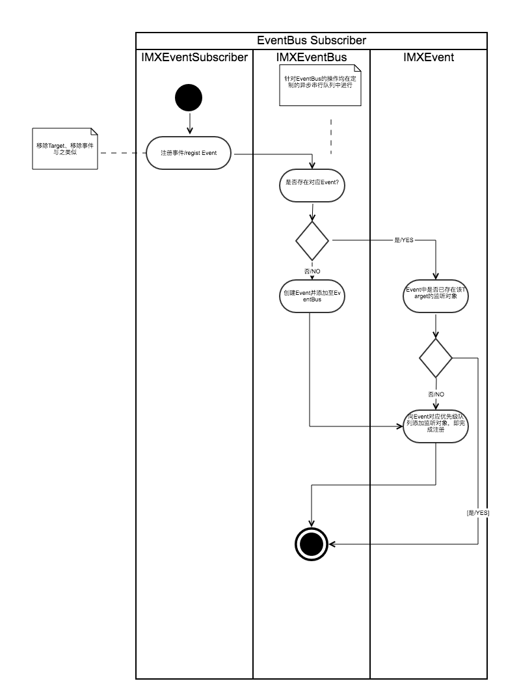
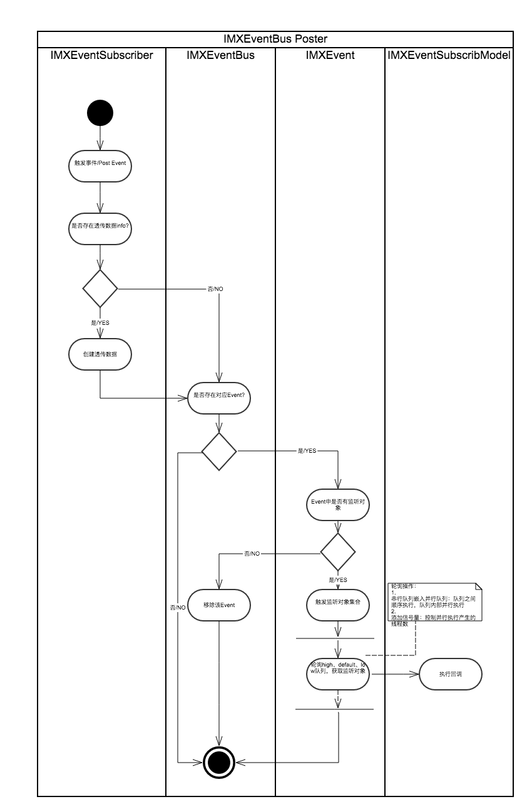

# IMXEventBus


## #功能列表：
* 以订阅/发布的模式实现跨组件通信，也即通信模块。类似`NSNotification `的通信功能。
* 生命周期管理：注册的事件订阅者可自动释放，也可手动管理其释放时机。
* 优先级处理：触发事件时，通过预设值的优先级，决定执行订阅者回调的先后顺序。
* 订阅者回调在主线程/非主线程执行的控制。
* Debug模式下：增加输出所有Event信息。


## #如何使用：

### 1.）导入：
1. Cocoapods：pod 'IMXEventBus', '~> 1.0.0'

2. 手动导入：本库无依赖其它三方库，直接将`IMXEventBus`文件夹拖入项目即可。

### 2.）头文件引入：

```
#import "IMXEventBusKit.h"
```
	
### 3.）功能使用：
###### 1. 注册：

1. 简略模式：


	```
//默认值：
//优先级:Default;回调执行：非主线程
[IMXEventSubscriber addTarget:self name:@"login_eventName" action:^(IMXEventUserInfo *info) {
        NSLog(@"callback info:%@    thread:%@",[info description],[NSThread currentThread]);
    }];

	```

2. 全参模式：


	```
	[IMXEventSubscriber addTarget:self name:@"login_eventName" priority:IMXEventSubscriberPriorityDefault inMainTread:YES action:^(IMXEventUserInfo *info) {
		NSLog(@"callback info:%@    thread:%@",[info description],[NSThread currentThread]);
    }];
	
	```
	

* **默认情况下，优先级是default，回调均是在非主线程下执行。**

###### 2. 触发事件：

1. 简略模式：


	```
//默认值：
//被触发的事件：不强制在主线程中执行回调
[IMXEventPoster postEventName:@"login_eventName" object:@{@"userName":@"demo"}];

	```
	
2. 全参模式：

	```
[IMXEventPoster postEventName:@"login_eventName" object:nil forceMain:YES];

	```
	
* **默认情况下，firceMain：NO。即所有被触发的监听对象，其回调执行均参考自身属性`isInMainThread `；否则均强制在主线程执行。**

###### 3. Debug:

1. 功能汇总（仅在Debug模式下，log处理）：

	1. 重复添加target对应的同一事件时，会打印或者弹出log提示。
	2. post时，无对应的监听者存在，会打印或者弹出log提示。
	3. Debug模式下：输出所有Event信息。（便于检测当前无订阅者的僵尸事件以及未被触发的事件）

		> 注：仅输出之前的Event调用情况，无法检测输出之后的log，故输出的数目不代表最终数据。

2. 开启Debug功能：默认不开启。

	```
	
	[IMXEventDebug_share enableDebug:YES];
    IMXEventDebug_share.debugType = IMXEventDebugTypeAlert;
    
	```
	
* **无论如何设置，Debug功能仅在Debug模式下起作用。**


## #要点及图谱：
* 注册事件、触发事件、移除事件等操作均针对同一队列操作：所有操作均嵌入异步串行队列之中，保证了资源存取的线程安全。
* 事件监听者对象分别由3个不同优先级的NSMapTable队列存储：以`Target:Model`方式存储，对应Target由于生命周期问题释放后，那么事件队列中相关条目会被自动释放。但无法实时检测到，故发布事件时均需巡检一次。
* 触发事件时：轮询3个不同优先级对类，执行每个监听者对象的回调：执行操作均放在并行队列中，并创建信号量控制线程的数量。且并行队列嵌入在串行队列中，保证3个对类按其优先级顺序执行。

图谱1：类图结构


图谱2：事件注册流程图



图谱3：事件触发流程图



## #结构描述：

#### 一、数据：
###### 1. IMXEventSubscribModel：订阅者对象

* 数据
	1. actionBlock：post触发时执行该回调
	2. priority：优先级，决定订阅者对象预置入哪个队列以及后续执行序列。（在IMXEventBus中使用）
	3. isInMainThread：是否在主线程/非主线程执行actionBlock
	4. target：弱引用形式，暂未使用场景
* 行为：

	1. ``actionWIthInfo:forceMainThread: ``:回调执行最终实现


###### 2. IMXEventUserInfo：poster传输数据

* 数据

	1. userInfo:字典对象
	2. 待扩展

	
#### 二、逻辑处理：

###### 1. IMXEvent：事件

* 功能：单一事件对象。

	1. 注册订阅者对象
	2. 响应poster触发事件
	3. 即管理和调度订阅者队列

* 数据：

	1. eventName：事件名称，唯一标识一个事件。
	2. mapHigh、mapDefault、mapLow：私有属性。订阅者队列。NSMaptable定制，target释放，对应记录也自动释放的特性。

* 行为：

	1. ``hasContainedSubscribModelForKey:``：检查各队列中是否包含Key对应的订阅者。
	2. ``registSubscribModel:forKey:``：注册订阅者至对应队列。
	3. ``postEventWithDeliveryData:isInMain``：事件出发，逐个执行事件中各队列的订阅者行为。

		1. 并行队列嵌入至串行队列：保证3个优先级队列顺序执行。
		2. 并行队列：保证单个事件队列中各订阅者行为并行执行。
		3. 信号量处理：控制线程数量，并行数。

	4. ``deleteEntryForTarget:``：删除事件中Target对应的一条订阅者记录。
	5. ``isEmptyMap``：各优先级对应的队列是否全为空


###### 2. IMXEventBus:单例模式，事件集合。
* 数据：

	1. events：事件集合。所有针对该集合的处理均在异步线程中串行执行，非阻塞主线程行为。

* 行为：

	1. ``registSubscribModel:markEvent:priority:inMainTread:action:``：注册订阅者
	2. ``publishEvent:delivery:isFromMainTread:``：触发事件
	3. ``unregistSubscribModelFromTarget:``： 解注册Target对应的订阅者：若解除后事件无相关订阅者，则移除该Event对象。
	4. ``removeEvent:``： 移除事件

	
#### 三、public文件：

###### 1. IMXEventSubscriber：注册订阅者

主要是针对`IMXEventBus`注册接口的封装。如将`优先级`和`是否主线程执行回调`统一置常用值为默认值。

###### 2. IMXEventPoster：post触发事件

主要是针对`IMXEventBus`发布接口的封装。将`是否主线程执行回调`统一置常用值为默认值。


## #待完善：

1. Target子类化对象中与Target本身存在有同名事件处理问题（过滤去重功能）。
2. 延时触发事件。
3. 条件触发。
4. 其它

## #参考：
* [GCD](https://github.com/ming1016/study/wiki/%E7%BB%86%E8%AF%B4GCD%EF%BC%88Grand-Central-Dispatch%EF%BC%89%E5%A6%82%E4%BD%95%E7%94%A8)
* [线程安全](https://developer.apple.com/library/content/documentation/Cocoa/Conceptual/Multithreading/ThreadSafetySummary/ThreadSafetySummary.html)
* [http://www.cocoachina.com/ios/20160225/15422.html](http://www.cocoachina.com/ios/20160225/15422.html)
* [Java EventBus](https://github.com/greenrobot/EventBus)
* [https://github.com/lyeah/EventBus/tree/master/EventBus](https://github.com/lyeah/EventBus/tree/master/EventBus)
* [https://github.com/AKACoder/ABCEventBus](https://github.com/AKACoder/ABCEventBus)
* [https://github.com/benjamincombes/EventBus](https://github.com/benjamincombes/EventBus)
* [https://github.com/kouky/EventBus](https://github.com/kouky/EventBus)
* [https://github.com/ShezHsky/EventBus](https://github.com/ShezHsky/EventBus)
* [https://github.com/chausson/XEBEventBus](https://github.com/chausson/XEBEventBus)
* [https://github.com/favret/Magic-Swift-Bus](https://github.com/favret/Magic-Swift-Bus)
* [https://github.com/l9y/SwiftEvent](https://github.com/l9y/SwiftEvent)
* [https://github.com/cesarferreira/SwiftEventBus](https://github.com/cesarferreira/SwiftEventBus)
* [https://github.com/aixinyunchou/OCEventBus](https://github.com/aixinyunchou/OCEventBus)
* [https://github.com/goodow/GDChannel](https://github.com/goodow/GDChannel)

## #更新Pods开源库

1. 提交code至github，或改version或保持不变（更改版本时不需要第3步骤）。
2. pod trunk register <email@XX.com> '<name>' --description='<description>'
3. pod trunk delete IMXEventBus 1.0.0
4. pod trunk push --allow-warnings
5. 使用时：pod setup更新

参考链接：[https://www.jianshu.com/p/d6beddcce8bb](https://www.jianshu.com/p/d6beddcce8bb)
